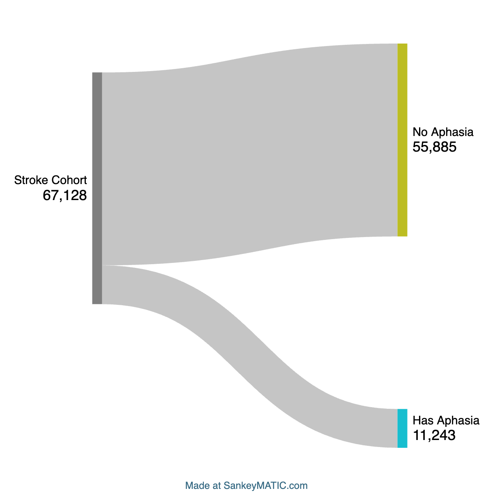
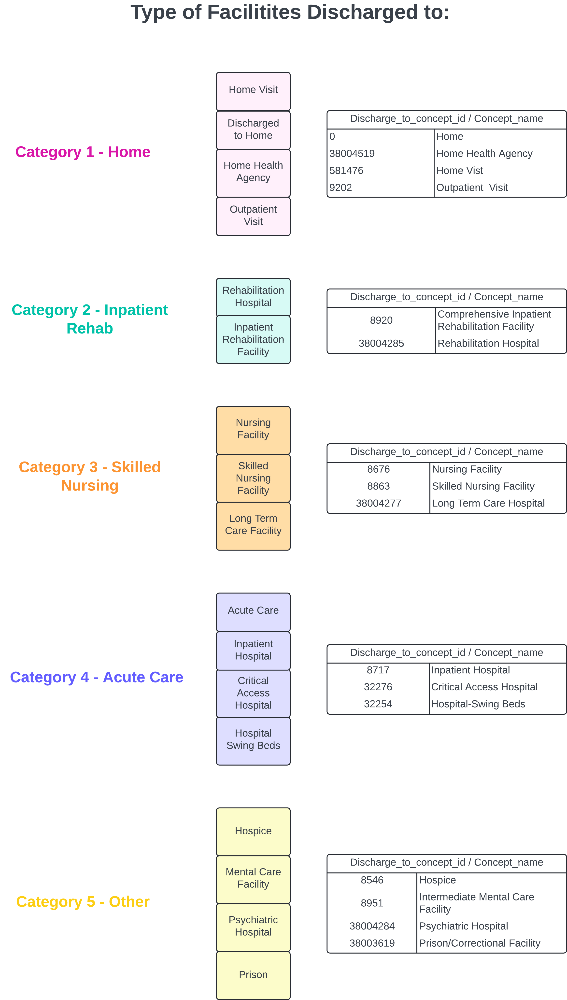

## md file for test visuals/groupings

**1. Stroke Cohort (67,128): No Aphasia vs Has Aphasia**

**2. Facilities patients can be discharged to**
(Category organization determined by Rob and Casey)

