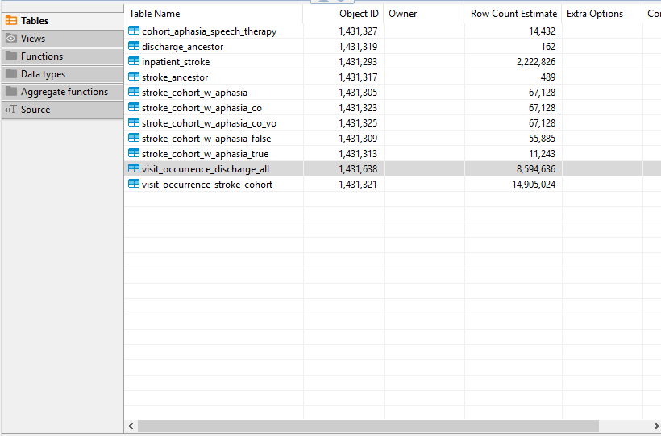

# Identification of Patterns in Stroke Care Transitions using [OHDSI](https://ohdsi.northeastern.edu/) Pharmetrics+ data

Stroke survivors receive rehabilitation services (physical therapy, occupational therapy, and/or speech-language therapy) in different locations at different rates in the period following their stroke.  Differences between levels of care location as well as type of care delivered has been identified as a path to understanding the differences in the quality of stroke post-acute treatment in order to optimize stroke outcomes. 

Our hypothesis is that it is possible to use OHDSI data to trace the various paths that stroke survivors take through post-incident care so that the efficacy and efficiency of the different care transitions can be evaluated.  We were able to create a proof-of-concept process on a limited cohort (stroke patients with aphasia, with patient IDs attached to their post-acute speech therapy treatments and treatment locations)  to show it is possible to trace the different paths through treatment post-stroke.  To replicate our process, please follow the steps below. Note that for true reproducability it is necessary to access the AWS for the Northeastern OHDSI Center.

## OHDSI + Setup

In order to access the OHDSI database, several initial steps are required. The user must complete CITI certifications specified by Northeastern's Observational Health Data Sciences and Informatics Center (OHDSI). After the certifications are completed, the user will follow OHDSI's [User Guide](https://northeastern.sharepoint.com/sites/OHDSINortheastern/Shared%20Documents/Forms/AllItems.aspx?ga=1&OR=Teams%2DHL&CT=1728075445537&clickparams=eyJBcHBOYW1lIjoiVGVhbXMtRGVza3RvcCIsIkFwcFZlcnNpb24iOiI1MC8yNDA4MTcwMDQyMSIsIkhhc0ZlZGVyYXRlZFVzZXIiOmZhbHNlfQ%3D%3D&id=%2Fsites%2FOHDSINortheastern%2FShared%20Documents%2FOHDSI%20Lab%20%2D%20User%20Group%2FUser%20Guide%2FLatest&viewid=e9534233%2D4089%2D42ed%2D8956%2D298feac7e723) to onboard onto OHDSI's dashboard and then set up the virtual desktop with AWS Workspaces. The primary tutorials provided for environment set up are in R so we created a tutorial to set up an enviroment using Python. Details are included below.

## Step 0: Setup environment

These steps work in relation to one having access to OHDSI's Amazon Workspace.

Follow each step in the [tutorial](tutorial/README.md). This repo is a quick tutorial of how to use python for the OHDSI database.
Steps include:

1. AWS Setup
2. Miniconda
3. Python environment
4. git
5. make
6. Config of Redshift credentials
7. Redshift database connection
8. Pandas to process tables, read, and write

<small>_Refer to [config_template.ini](/tutorial/config_template.ini) and [how_to_use_templates.md](/tutorial/how_to_use_templates.md) for additional help._</small>

## Step 1: Create intermediate tables

We will create various intermediate tables in your own schema. This is done because directly using tables in 'omop_cdm_53_pmtx_202203' schema, which is the original data, every time an analysis is performed is extremely slow, since the number of data points in those tables are on a scale of billions. We will use the stroke cohort definition created by Casey Tilton as an index table to filter out any relevant (stroke diagnosis) person_IDs from the omop schema into a table written into your work schema. As a result, you will be working on tables that are on a maximum size of a million data points in maximum. Run the following command on your Anaconda PowerShell Prompt. Make sure you are at your directory which cloned this repo:

```
 make create_tables
```

This command is going to run 11 .py files in a correct order. Each of the .py files correspond to each intermediate table that is created. Notice that some of the intermediate tables will require other intermediate tables to be created first, so the order of running these .py files is very important. Now open DBeaver, and check your work space. You must have following tables in your schema now:

<br>

<br>

Note that your Object ID won't match these exactly. Important part is if the Row Count Estimate is the same, and make sure none of them are empty. You can check if the tables are empty by double clicking the table name and check the 'Data' tab.

If you see any error, please refer to the 'Makefile' and try running each .py file individually. For example, if you had an error message while 'stroke_ancestor' table is being created, try running the following command:

```
make stroke_ancestor
```

This is going to run the 'stroke_ancestor.py' file only, and you can debug by opening the 'stroke_ancestor.py' file and reading through the code.

## Step 2: Plotting

The following make commands can be used in your Anaconda PowerShell Prompt to plot the figures we have in this repo:

```
make plot_stroke_desc_concept

make plot_has_aphasia

make plot_stroke_type_aphasia_TRUE

make plot_stroke_type_aphasia_FALSE

make plot_first_discharge

make plot_speech_therapy_aphasia
```

'make plot_first_discharge' will run 3 .py files, while other commands will only run one .py file at a time.

Confirm you produce the same plots as we did in our [EDA](docs/EDA.md).

## Step 3: Analysis of discharge path

The actual analysis of discharge paths of stroke patients are done by following command:

```
 make analysis_visit_oc_5_discharge
```

This analysis is done very simply to provide a frame of what to work on next regarding discharge paths of stroke patients. Any user who wants to do a further analysis regarding discharge paths of stroke patients may use this result as a beginning point.


## Lessons Learned

1. Did your project objectives change based on what your learned from the data or stakeholder?

   We treated this project as an AGILE endeavor; a waterfall approach would likely have lead to failure at worst, extreme frustration at best.  Our objectives changed both as we explored the data and as we met with the stakeholder, Rob Cavanaugh, each week to share our progress. Rob provided insight into the potential ways to access the data we needed for analysis of care pathways. He provided stroke and speech language codes and suggestions for how to determine if a visit could fall under PT vs OT. Our project team had regular stand-up meetings to discuss blockers, report on progress, and plan next steps.
   
3. Were data-access or data processing challenges harder than you anticipated?

   As noted in our [docs/README.md](docs/README.md), there was a learning curve with the complexity of the OHDSI database since the data is drawn from real-world interactions and the schema connections can be hard to navigate without a medical knowledge. A medical condition can have various codes associated with it, and these codes can also change throughout a patient's care timeline.  Gaps in data availability and comprehensiveness were an additional challenge; As our team tested tables and fields in queries, we often ran into dead ends because of missing data, and had to search for alternate paths to acquire necessary data points.  That the database uses OMOP, or the Observational Medical Outcomes Partnership, a common data model (CDM) to standardize healthcare data, was a blessing.  Not every relational databases has clean, consistent linking variables without tidying first.

## Next Steps  

The next step would be to create cohorts for all potential paths, e.g., aphasia versus no aphasia diagnosis, different types of treatment, and different locations.  We would recommend: 

1. Identifying the best markers/concept_IDs for physical and occupational therapy 

2. Matching those therapies to patient_IDs from the master stroke incidence file 

3. Creating a table with location by visit_start_date, visit_end_date, and discharge_to location for each patient_ID (note that by definition of the initial cohort, the first location is always emergency room and/or inpatient hospital stay) 

4. Appending location by date to each therapy to each patient_ID

Analysis can be performed on the resulting table to find: 

- Frequency of therapies, overall and by location 

- Duration (in days) of therapies, overall and by location 

Given that Northeastern University’s ODHSI database is incomplete, there is additional data that would be helpful to simplify the process, though it is possible to complete the analysis without this data: 

- Comprehensive provider_specialty data 

- Care_site_type and concept_id in the care_site table 

## Attributions

#### Rob Cavanaugh | Stakeholder

- [List of speech language codes](https://northeastern-my.sharepoint.com/:w:/g/personal/r_cavanaugh_northeastern_edu/EffBdbdsX4hHokqQF2ryo9wBL7VERApjQ5klmlApGWdqzw?e=5w74PB)

#### Casey Tilton | Data Science Capstone Student

- [SQL query for cohort creation](https://northeastern-my.sharepoint.com/personal/tilton_ca_northeastern_edu/_layouts/15/onedrive.aspx?id=%2Fpersonal%2Ftilton%5Fca%5Fnortheastern%5Fedu%2FDocuments%2FMicrosoft%20Teams%20Chat%20Files%2Fstroke%5Fcohort%5Fcreation%2Esql&parent=%2Fpersonal%2Ftilton%5Fca%5Fnortheastern%5Fedu%2FDocuments%2FMicrosoft%20Teams%20Chat%20Files&ga=1)

#### Philip Bogden | DS5110 Professor

- [git-intro repo](https://github.com/ds5110/git-intro)

## Resources

**OHDSI**

- [OHDSI Northeastern](https://ohdsi.northeastern.edu/)
- [OHDSI @ Northeastern | Sharepoint](https://northeastern.sharepoint.com/sites/OHDSINortheastern/Shared%20Documents/Forms/AllItems.aspx?id=%2Fsites%2FOHDSINortheastern%2FShared%20Documents%2FOHDSI%20Lab%20%2D%20User%20Group&p=true&ga=1&OR=Teams%2DHL&CT=1728075445537&clickparams=eyJBcHBOYW1lIjoiVGVhbXMtRGVza3RvcCIsIkFwcFZlcnNpb24iOiI1MC8yNDA4MTcwMDQyMSIsIkhhc0ZlZGVyYXRlZFVzZXIiOmZhbHNlfQ%3D%3D)
- [OHDSI User Guide](https://northeastern.sharepoint.com/sites/OHDSINortheastern/Shared%20Documents/Forms/AllItems.aspx?ga=1&OR=Teams%2DHL&CT=1728075445537&clickparams=eyJBcHBOYW1lIjoiVGVhbXMtRGVza3RvcCIsIkFwcFZlcnNpb24iOiI1MC8yNDA4MTcwMDQyMSIsIkhhc0ZlZGVyYXRlZFVzZXIiOmZhbHNlfQ%3D%3D&id=%2Fsites%2FOHDSINortheastern%2FShared%20Documents%2FOHDSI%20Lab%20%2D%20User%20Group%2FUser%20Guide%2FLatest&viewid=e9534233%2D4089%2D42ed%2D8956%2D298feac7e723)
- [The Book of OHDSI](https://ohdsi.github.io/TheBookOfOhdsi/)
- [OHDSI Lab Login](https://ohdsi-lab.roux-ohdsi-prod.aws.northeastern.edu/#/login)
- [Athena](https://athena.ohdsi.org/search-terms/start)

<br>

**OMOP**

- [OMOP Common Data Model](https://ohdsi.github.io/CommonDataModel/index.html)
- [OMOP CDM v5.4](https://ohdsi.github.io/CommonDataModel/cdm54.html)
