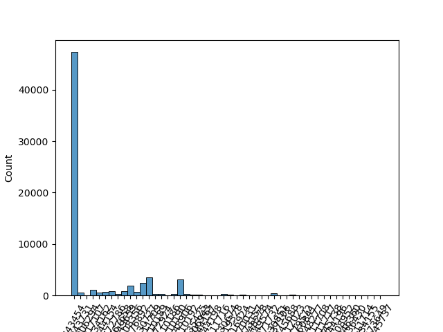

# Exploratory Data Analysis (EDA)

# Setup

- Read [tutorial](tutorial.md) to setup your environment.
- [how_to_use_templates](how_to_use_templates.md) teaches you how to use python to access redshift database. You can use dbeaver as a visualization tool with it.

## Create intermediate tables

- Following command will create a table 'inpatient_stroke' into your work schema:

```
make inpatient_stroke
```

- Following command will create a table 'stroke_cohort_w_aphasia' into your work schema:

```
make stroke_cohort_w_aphasia
```

## Analysis

- Run following command to get table information and figures from 'stroke_cohort_w_aphasia':

```
make test
```

- The info of Pandas dataframe of 'stroke_cohort_w_aphasia' is following:

```
<class 'pandas.core.frame.DataFrame'>
RangeIndex: 67128 entries, 0 to 67127
Data columns (total 10 columns):
 #   Column                         Non-Null Count  Dtype
---  ------                         --------------  -----
 0   condition_occurrence_id        67128 non-null  int64
 1   person_id                      67128 non-null  int64
 2   condition_concept_id           67128 non-null  int64
 3   condition_start_date           67128 non-null  object
 4   condition_end_date             67128 non-null  object
 5   row_num                        67128 non-null  int64
 6   observation_period_start_date  67128 non-null  object
 7   observation_period_end_date    67128 non-null  object
 8   observation_period_id          67128 non-null  int64
 9   has_aphasia                    67128 non-null  int64
dtypes: int64(6), object(4)
```

- The number of data points are reduced to 67,128, since we are only looking into datapoints that are 'inpatient' and 'strokes'. This is much manageable size of data now.

<br>

<br>

- The plot shows that '443454' code, which is Cerebral infarction, is the most common case.
- There are many other 'condition_concept_id' in here, which are more specific disease codes within the 7 strokes.
  <br>
  <br>

# Further Proposal Notes

Our project will establish stroke patient ‘paths’ through treatment, to further disaggregate the initial cohort definition that captures first-occurance in-patient and emergency department stroke diagnosis. We will focus our path on physical location of patients after inpatient discharge, and indication of whether they have received physical/occupational and/or speech therapy. The objective is to create defined paths that will support future research on the efficacy of different treatment processes, location, and duration.

Our cohort definition is based on a SQL query developed by Casey Tilton, a capstone student also working with the OHDSI database on questions around stoke victims. We have reviewed and refined Casey’s script; his original SQL code is stored here: docs/Stroke_cohort.md

**Population (N) = 67,128**

**The Stroke Diagnosis Categories Are:**


<br>
<br>

**From there, each group, divided by diagnosis will be further divided into discharge type:**

- Home Visit
- Discharged to Home
- Rehabilitation Hospital
- Skilled Nursing Facility
- Home Health Agency
- Long Term Care Facility
- Hospice

Note that further investigations may find that the following additional, low incidence discharge facilities may be appropriately included in one of the larger above groups. We plan to run separate analysis of these groups to determine if their subsequent experience and process is close enough to the top seven discharge facilities to include in one:

- Intermediate Medical Care Facility
- Hospital Swing Beds
- Critical Access Hospital
- Comprehensive Inpatient Rehabilitation Facility

**From there, each group, divided by diagnosis will be further divided into treatment type:**

- Physical and occupational therapy
- Speech therapy
- Combination of physical, occupational, and speech therapy
  
At this point, there will be the following initial paths:

- Type of stroke (7 separate groups including dependencies)
- Discharge destination (7 groups divided into 7 discharge locations, or 49 groups)
- Type of therapy (49 groups divided into 3 treatment types, or 147 groups)

**Potential addtional path parameters**

The project stakeholder has suggested we end the trace of a path when the cohort following the path reaches approximately n = 1% to 2% of the original cohort group, or when the path reaches a ‘dead end’ because remaining data splits are found to be not relevant.

Potential further path tracing beyond 147 groups, dependent on sample size in group (minimum n for pursuing additional paths approxiamtely 670 unique patients):

- Duration of therapy (measured in number of occurances)
- Aphasia diagnosis
- Total duration of treatment from initial stroke diagnosis to final stroke-related therapy (measured in days)

<br>


# Background

**Entity-Relationship Diagram of OMOP, the model OHDSI is based on:**


<br>
<br>

**Our edited version of the ER diagram based on the current Cohort Query:**


