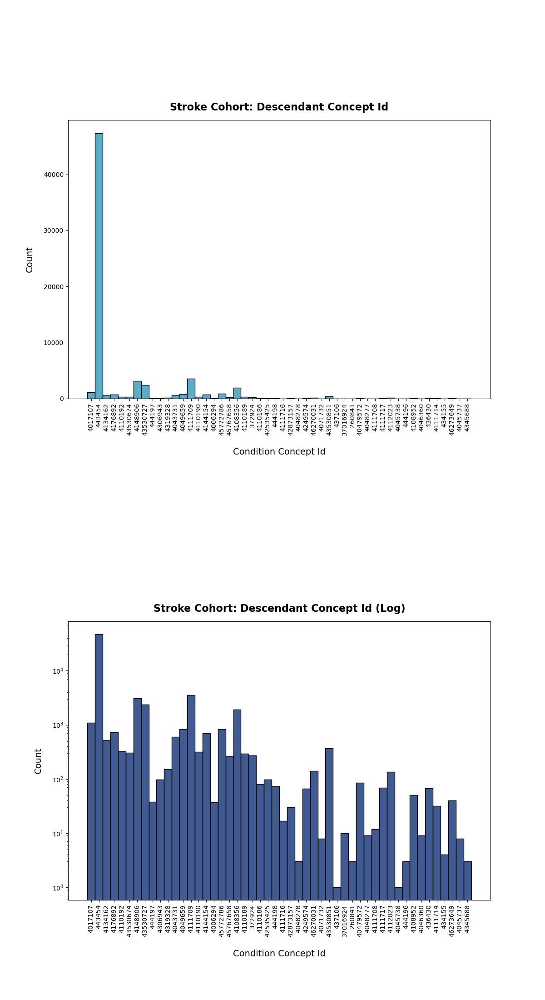
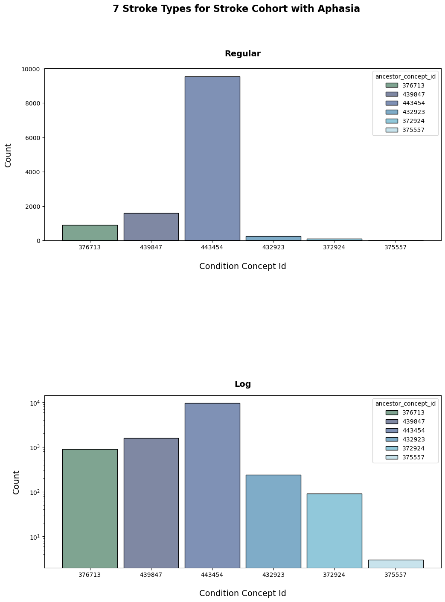
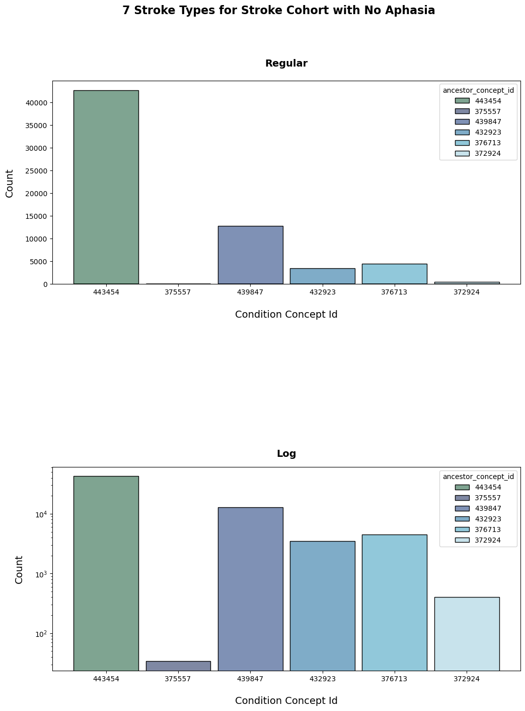
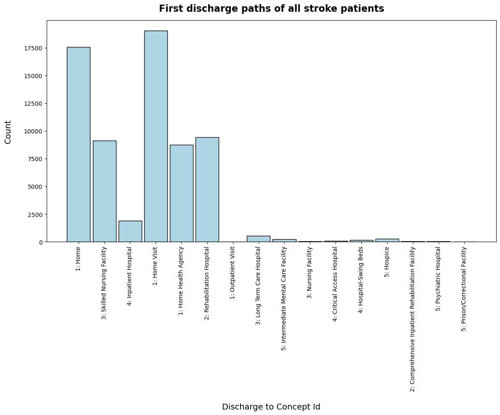
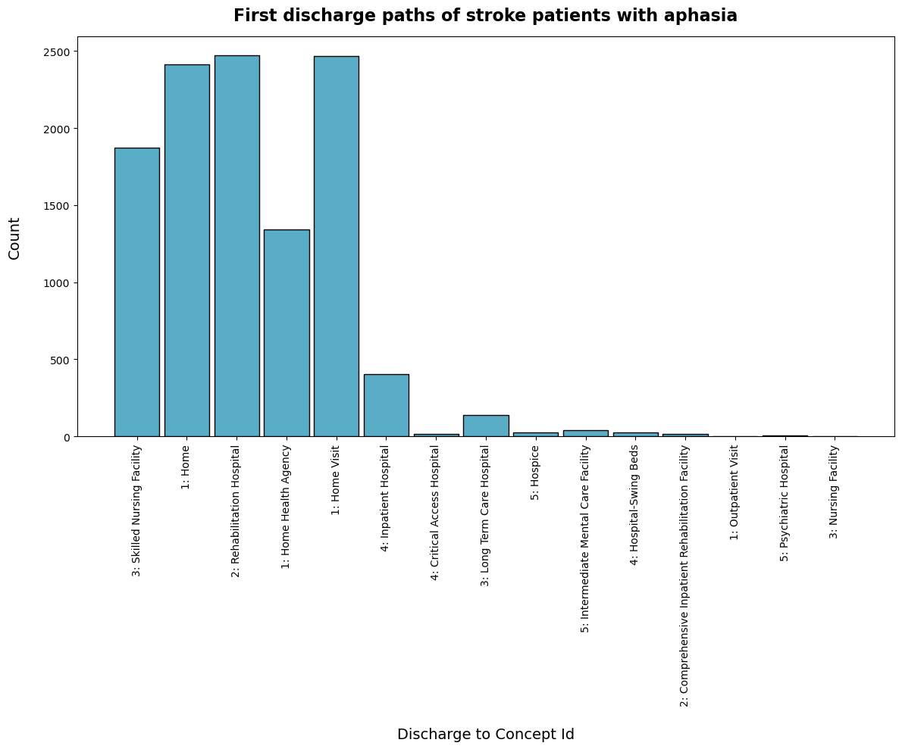
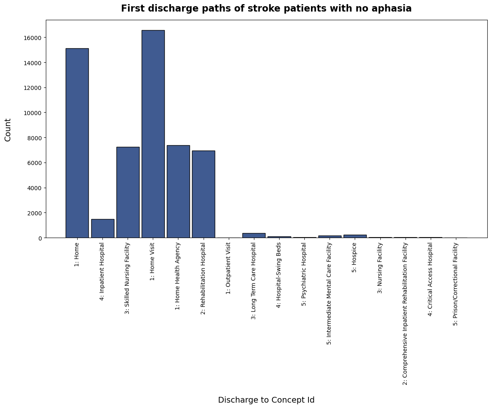
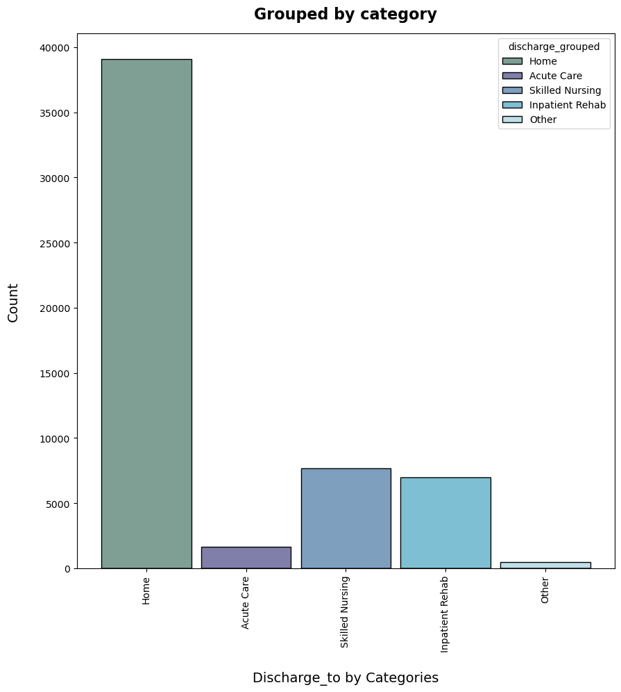
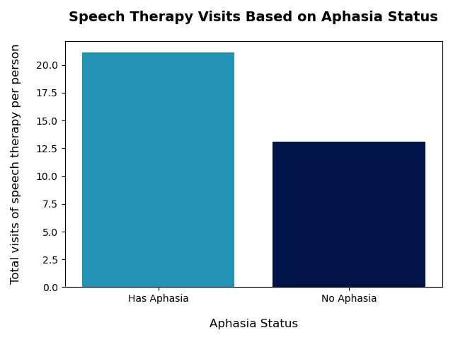

# Exploratory Data Analysis (EDA)

## Setup

- Follow the steps in [README](../README.md) to obtain all intermediate tables and figures that are being used here.

## Conditions for intermediate tables

- inpatient_stroke(created by inpatient_stroke.py): The SQL query is defined by Casey Tilton. Refer to his work for more details.
- stroke_cohort_w_aphasia(created by stroke_cohort_w_aphasia.py): The SQL query is defined by Casey Tilton. Refer to his work for more details.
- stroke_cohort_w_aphasia_co(created by stroke_cohort_w_aphasia_co.py): added columns of 'visit_occurrence_id', 'visit_detail_id' and 'provider_id' by joining the original 'condition_occurrence' table.
- stroke_cohort_w_aphasia_co_vo(created by stroke_cohort_w_aphasia_co_vo.py): added columns of 'visit_start_date', 'visit_end_date' and 'discharge_to_concept_id' by joing the original 'visit_occurrence' table.
- stroke_cohort_w_aphasia_FALSE(created by stroke_cohort_w_aphasia_FALSE.py): Filtered 'stroke_cohort_w_aphasia' by condition 'has_aphahsia = 0'
- stroke_cohort_w_aphasia_TRUE(created by stroke_cohort_w_aphasia_TRUE.py): Filtered 'stroke_cohort_w_aphasia' by condition 'has_aphahsia = 1'
- stroke_ancestor(created by stroke_ancestor.py): Filtered original concept_ancestor table by stroke codes, so this table has only ancestor-descendant relationship of 7 ancestor stroke codes.
- discharge_ancestor(created by discharge_ancestor.py): Filtered original concept_ancestor table by visit codes of distinct discharge_to_concept_id in 'stroke_cohort_w_aphasia_co_vo', so this table has only ancestor-descendant relationship of 16 visit codes representing discharge paths.
- visit_oc_stroke_cohort(created by visit_oc_stroke_cohort.py): Filterd the original visit_occurrence table by person_id in 'stroke_cohort_w_aphasia'.
- visit_oc_discharge_all(created by visit_oc_discharge_all.py): Filtered 'visit_occurrence_stroke_cohort' by picking only events with 'visit_end_date' > 'condition_end_data'.
- speech_therapy_count_dates(created by speech_therapy_count_dates.py): Join the original 'procedure_occurrence' table and 'stroke_cohort_w_aphasia' table, and filter it by speech therapy codes.

## Preliminary Analysis for reproducibility

- All of the results in here can be compared with your results to ensure the reproducibility of the repo.
- Running following command will return you table information and figures from 'stroke_cohort_w_aphasia':

```
make plot_stroke_desc_concept
```

- The info of Pandas dataframe,'stroke_cohort_w_aphasia', is the following:

```
<class 'pandas.core.frame.DataFrame'>
RangeIndex: 67128 entries, 0 to 67127
Data columns (total 10 columns):
 #   Column                         Non-Null Count  Dtype
---  ------                         --------------  -----
 0   condition_occurrence_id        67128 non-null  int64
 1   person_id                      67128 non-null  int64
 2   condition_concept_id           67128 non-null  int64
 3   condition_start_date           67128 non-null  object
 4   condition_end_date             67128 non-null  object
 5   row_num                        67128 non-null  int64
 6   observation_period_start_date  67128 non-null  object
 7   observation_period_end_date    67128 non-null  object
 8   observation_period_id          67128 non-null  int64
 9   has_aphasia                    67128 non-null  int64
dtypes: int64(6), object(4)
```

- The number of data points are reduced to 67,128, since we are only looking into datapoints that are 'inpatient' and 'strokes'. This is much manageable size of data now.

- You will also see every descendant concept ID in this dataframe in the command window:

```
Descendant concept ID in the stroke cohort is:
[ 4017107   443454  4134162  4176892  4110192 43530674  4148906 43530727
   444197  4306943  4319328  4043731  4049659  4111709  4110190  4144154
  4006294 45772786 45767658  4108356  4110189   372924  4110186 42535425
   444198  4111716 42873157  4048278  4249574 46270031  4071732 43530851
   437106 37016924   260841 40479572  4048277  4111708  4111717  4112023
  4045738   444196  4108952  4046360   436430  4111714   434155 46273649
  4045737  4345688]
```

- You can check if they are all stroke related codes.



- The plot shows that '443454' code, which is Cerebral infarction, is the most common case.
- There are many other 'condition_concept_id' in here, which are more specific disease codes within the 7 strokes.
  <br>
- Run the following command to get a figures to show the rate of aphasia in 'stroke_cohort_w_aphasia':

```
make plot_has_aphasia
```

- The following info will be shown in the command window:

```
<class 'pandas.core.frame.DataFrame'>
RangeIndex: 67128 entries, 0 to 67127
Data columns (total 10 columns):
 #   Column                         Non-Null Count  Dtype
---  ------                         --------------  -----
 0   condition_occurrence_id        67128 non-null  int64
 1   person_id                      67128 non-null  int64
 2   condition_concept_id           67128 non-null  int64
 3   condition_start_date           67128 non-null  object
 4   condition_end_date             67128 non-null  object
 5   row_num                        67128 non-null  int64
 6   observation_period_start_date  67128 non-null  object
 7   observation_period_end_date    67128 non-null  object
 8   observation_period_id          67128 non-null  int64
 9   has_aphasia                    67128 non-null  int64
dtypes: int64(6), object(4)
```

<br>

<br>

- As you can see, more stroke patients have no aphasia.
  <br>
  <br>

- Run following command to get information and figures for the 7 stroke types of the stroke cohort with aphasia:

```
make plot_stroke_type_aphasia_TRUE
```

- Following info will be shown in the command window:

```
<class 'pandas.core.frame.DataFrame'>
RangeIndex: 12388 entries, 0 to 12387
Data columns (total 14 columns):
 #   Column                         Non-Null Count  Dtype
---  ------                         --------------  -----
 0   condition_occurrence_id        12388 non-null  int64
 1   person_id                      12388 non-null  int64
 2   condition_concept_id           12388 non-null  int64
 3   condition_start_date           12388 non-null  object
 4   condition_end_date             12388 non-null  object
 5   row_num                        12388 non-null  int64
 6   observation_period_start_date  12388 non-null  object
 7   observation_period_end_date    12388 non-null  object
 8   observation_period_id          12388 non-null  int64
 9   has_aphasia                    12388 non-null  int64
 10  ancestor_concept_id            12388 non-null  int64
 11  descendant_concept_id          12388 non-null  int64
 12  min_levels_of_separation       12388 non-null  int64
 13  max_levels_of_separation       12388 non-null  int64
dtypes: int64(10), object(4)
```

- As you can see, there are 12,388 stroke patients with aphasia.
  <br>
  <br>
  
  <br>

- As you can see, the '443454' code, which is Cerebral infarction, is the most common case. One of the stroke codes is not present.
  <br>
  <br>

- Run following command to get information and figures for the 7 stroke types of the stroke cohort with no aphasia:

```
make plot_stroke_type_aphasia_FALSE
```

- The following info will be shown in the command window:

```
<class 'pandas.core.frame.DataFrame'>
RangeIndex: 63820 entries, 0 to 63819
Data columns (total 14 columns):
 #   Column                         Non-Null Count  Dtype
---  ------                         --------------  -----
 0   condition_occurrence_id        63820 non-null  int64
 1   person_id                      63820 non-null  int64
 2   condition_concept_id           63820 non-null  int64
 3   condition_start_date           63820 non-null  object
 4   condition_end_date             63820 non-null  object
 5   row_num                        63820 non-null  int64
 6   observation_period_start_date  63820 non-null  object
 7   observation_period_end_date    63820 non-null  object
 8   observation_period_id          63820 non-null  int64
 9   has_aphasia                    63820 non-null  int64
 10  ancestor_concept_id            63820 non-null  int64
 11  descendant_concept_id          63820 non-null  int64
 12  min_levels_of_separation       63820 non-null  int64
 13  max_levels_of_separation       63820 non-null  int64
dtypes: int64(10), object(4)
```

- As you can see, there are 63,819 stroke patients with aphasia.
  <br>
  
  <br>
- As you can see, the '443454' code, which is Cerebral infarction, is still the most common case. One of the stroke codes is still not present.
  <br>
  <br>

## Analysis of discharge paths related to aphasia

- Run following command to get a plot of types of the first discharge paths for all stroke patients, with or without aphasia:

```
make plot_first_discharge
```

- This command will create 3 plots at a time. You have to close the window for a plot for the next .py file to be run. The command window will display following:

```
python -B src/plot_first_discharge.py
Connection is created. Your work schema is 'work_oh_jaee211'
Executed query:

SELECT *
FROM work_oh_jaee211.stroke_cohort_w_aphasia_co_vo
;

Connection is closed.
First discharge concept IDs are: ['1: Home' '1: Home Health Agency' '1: Home Visit' '1: Outpatient Visit'
 '2: Comprehensive Inpatient Rehabilitation Facility'
 '2: Rehabilitation Hospital' '3: Long Term Care Hospital'
 '3: Nursing Facility' '3: Skilled Nursing Facility'
 '4: Critical Access Hospital' '4: Hospital-Swing Beds'
 '4: Inpatient Hospital' '5: Hospice'
 '5: Intermediate Mental Care Facility' '5: Prison/Correctional Facility'
 '5: Psychiatric Hospital']
There are 16 types of discharge types for all stroke patients
python -B src/plot_first_discharge_aphasia_TRUE.py
Connection is created. Your work schema is 'work_oh_jaee211'
Executed query:

SELECT *
FROM work_oh_jaee211.stroke_cohort_w_aphasia_co_vo
WHERE has_aphasia = 1
;

Connection is closed.
First discharge concept IDs are: ['1: Home' '1: Home Health Agency' '1: Home Visit' '1: Outpatient Visit'
 '2: Comprehensive Inpatient Rehabilitation Facility'
 '2: Rehabilitation Hospital' '3: Long Term Care Hospital'
 '3: Nursing Facility' '3: Skilled Nursing Facility'
 '4: Critical Access Hospital' '4: Hospital-Swing Beds'
 '4: Inpatient Hospital' '5: Hospice'
 '5: Intermediate Mental Care Facility' '5: Psychiatric Hospital']
There are 15 types of discharge types for stroke patients with aphasia
python -B src/plot_first_discharge_aphasia_FALSE.py
Connection is created. Your work schema is 'work_oh_jaee211'
Executed query:

SELECT *
FROM work_oh_jaee211.stroke_cohort_w_aphasia_co_vo
WHERE has_aphasia = 0
;

Connection is closed.
First discharge concept IDs are: ['1: Home' '1: Home Health Agency' '1: Home Visit' '1: Outpatient Visit'
 '2: Comprehensive Inpatient Rehabilitation Facility'
 '2: Rehabilitation Hospital' '3: Long Term Care Hospital'
 '3: Nursing Facility' '3: Skilled Nursing Facility'
 '4: Critical Access Hospital' '4: Hospital-Swing Beds'
 '4: Inpatient Hospital' '5: Hospice'
 '5: Intermediate Mental Care Facility' '5: Prison/Correctional Facility'
 '5: Psychiatric Hospital']
There are 16 types of discharge types for stroke patients with no aphasia
```

- As you can see there are total of 16 discharge types for stroke patients. Discharge to 'Prison/Correctional Facility' was not present within stroke patients with aphasia.



- Most of the patients have returned to home after the stroke event.
- 'Skilled Nursing Facility' and 'Rehavilitation Hospital' were the next most common discharge path for the stroke patients.
- Other discharge paths are not likely to be the first discharge paths.



<br>
<br>
<br>



- Patients who were discharged to 'Inpatient Hospital' mostly had aphasia.
- Patients with aphasia are more likely to be discharged to 'Skilled Nursing Facility' and 'Rehavilitation Hospital' after the first stroke event.
- Patients with no aphasia have a higher rate of returning home after the first stroke event.

- Run the following command to get a plot of total visits of speech therapy per person of stroke patients with or without aphasia:

```
make plot_speech_therapy_aphasia
```



- Patients with aphasia require more speech therapies in average, which is an expected result.

## Analysis of discharge paths

- The following command will run an analysis of the first 5 discharge paths:

```
make analysis_visit_oc_5_discharge
```

- The command window will show the following after the above command:

```
<class 'pandas.core.frame.DataFrame'>
RangeIndex: 67119 entries, 0 to 67118
Data columns (total 21 columns):
 #   Column                     Non-Null Count  Dtype
---  ------                     --------------  -----
 0   person_id                  67119 non-null  int64
 1   visit_start_date_1         67119 non-null  object
 2   visit_source_concept_id_1  67119 non-null  object
 3   visit_end_date_1           67119 non-null  datetime64[ns]
 4   discharge_to_concept_id_1  67119 non-null  object
 5   visit_start_date_2         66873 non-null  object
 6   visit_source_concept_id_2  66873 non-null  object
 7   visit_end_date_2           66873 non-null  datetime64[ns]
 8   discharge_to_concept_id_2  66873 non-null  object
 9   visit_start_date_3         66606 non-null  object
 10  visit_source_concept_id_3  66606 non-null  object
 11  visit_end_date_3           66606 non-null  datetime64[ns]
 12  discharge_to_concept_id_3  66606 non-null  object
 13  visit_start_date_4         66258 non-null  object
 14  visit_source_concept_id_4  66258 non-null  object
 15  visit_end_date_4           66258 non-null  datetime64[ns]
 16  discharge_to_concept_id_4  66258 non-null  object
 17  visit_start_date_5         65840 non-null  object
 18  visit_source_concept_id_5  65840 non-null  object
 19  visit_end_date_5           65840 non-null  datetime64[ns]
 20  discharge_to_concept_id_5  65840 non-null  object
dtypes: datetime64[ns](5), int64(1), object(15)
```

- Number of patients discharge to the first place: 67,119
- Number of patients discharge to the second place: 66,873
- Number of patients discharge to the third place: 66,606
- Number of patients discharge to the fourth place: 66,258
- Number of patients discharge to the fifth place: 65,840
- As expected, the number of patients reduces as they discharge further.
- More detailed information of each patient on each discharge can be found by accessing each data point within the pandas dataframe that has been read in this source file.

# Further Proposal Notes

Our project will establish stroke patient ‘paths’ through treatment, to further disaggregate the initial cohort definition that captures first-occurance in-patient and emergency department stroke diagnosis. We will focus our path on physical location of patients after inpatient discharge, and indication of whether they have received physical/occupational and/or speech therapy. The objective is to create defined paths that will support future research on the efficacy of different treatment processes, location, and duration.

Our cohort definition is based on a SQL query developed by Casey Tilton, a capstone student also working with the OHDSI database on questions around stoke victims. We have reviewed and refined Casey’s script; his original SQL code is stored here: docs/Stroke_cohort.md

**Population (N) = 67,128**

**The Stroke Diagnosis Categories Are:**


<br>
<br>

**From there, each group, divided by diagnosis will be further divided into discharge type:**

- Home Visit
- Discharged to Home
- Rehabilitation Hospital
- Skilled Nursing Facility
- Home Health Agency
- Long Term Care Facility
- Hospice

Note that further investigations may find that the following additional, low incidence discharge facilities may be appropriately included in one of the larger above groups. We plan to run separate analysis of these groups to determine if their subsequent experience and process is close enough to the top seven discharge facilities to include in one:

- Intermediate Medical Care Facility
- Hospital Swing Beds
- Critical Access Hospital
- Comprehensive Inpatient Rehabilitation Facility

**From there, each group, divided by diagnosis will be further divided into treatment type:**

- Physical and occupational therapy
- Speech therapy
- Combination of physical, occupational, and speech therapy

At this point, there will be the following initial paths:

- Type of stroke (7 separate groups including dependencies)
- Discharge destination (7 groups divided into 7 discharge locations, or 49 groups)
- Type of therapy (49 groups divided into 3 treatment types, or 147 groups)

**Potential addtional path parameters**

The project stakeholder has suggested we end the trace of a path when the cohort following the path reaches approximately n = 1% to 2% of the original cohort group, or when the path reaches a ‘dead end’ because remaining data splits are found to be not relevant.

Potential further path tracing beyond 147 groups, dependent on sample size in group (minimum n for pursuing additional paths approxiamtely 670 unique patients):

- Duration of therapy (measured in number of occurances)
- Aphasia diagnosis
- Total duration of treatment from initial stroke diagnosis to final stroke-related therapy (measured in days)

<br>

# Background

**Entity-Relationship Diagram of OMOP, the model OHDSI is based on:**


<br>
<br>

**Our edited version of the ER diagram based on the current Cohort Query (inpatient_stroke):**


