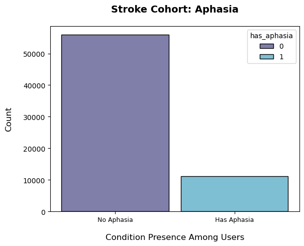
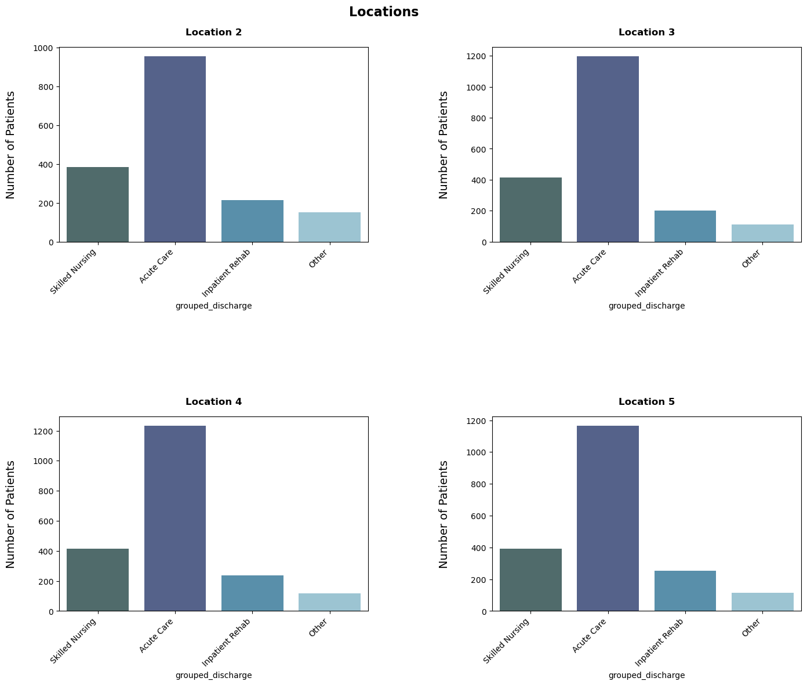

# Identification of Patterns in Stroke Care Transitions, using [OHDSI](https://ohdsi.northeastern.edu/) Pharmetrics+ data

Below are our results from working with the OHDSI database to determine care pathways for patients after their initial stroke. DS5110 Fall 2024

_Refer to the [Presentation pdf](/docs/presentation.pdf) for a brief overview of creating the tutorial and of our process and refer to the [EDA](/docs/EDA.md) for a more detailed overview._

## Major Findings

- Stroke patients with aphasia can be identified.
- Different locations post-acute care, with dates attached, can be tracked for individual patients.
- Speech therapy procedure occurrences, with dates, can be appended to patient records.

## Delivering an Interim Step

### 1. Establish Cohort

We used Casey Tilton's cohort query to cut the database down to size.

 

### 2. Append Aphasia Diagnosis

Rob Cavanaugh, our stakeholder, is a trained clinical speech language pathologist and has an interest in patients diagnosed with aphasia, a language disorder, after a stroke incident. The query creates an aphasia column, which allows us separate out those with and without aphasia when needed.

 

### 3.1 First Discharge Path for All Cohort Patients

We mapped each of the discharge_to_concept_ids to its concept name. Outlier discharge_to_concept_ids with too few instances were dropped.

 

### 3.2 Categories for Discharge Facilities - All

The dishcarge_to_concept_ids were grouped into categories based upon themed buckets created by Casey and Rob. The categories are Home, Skilled Nursing, Acute Care, Inpatient Rehab and Other. See [here](/docs/img/facility_category.png) for more detail on the codes and categories. Most patients are sent home after the stroke occurence.

 

### 3.3 Categories for Discharge Facilities - No Aphasia vs Aphasia

Two plots comparing the first discharge between those who do not have aphasia and those who do. The outcomes are similar though Inpatient Rehab is 3rd in location for No Aphasia and 2nd in location for those with Aphasia.

### No Aphasia

 

### Has Aphasia

 

### 4. Locations (2, 3, 4, 5)

This shows the 2nd, 3rd, 4th and 5th location for patients in their path after the 1st discharge. The patients who are discharged to home are taken out of circulation, which is why only 4 location categories are represented. This figure is our intial pass of verfiying that patient pathways can be created.

 

### 5. Speech Therapy

We tracked the number of speech therapy visits per patient based on their asphasia status. While those with aphasia represent a smaller portion of the cohort, they have a higher visit total for speech therapy than their counterpart.

## Challenges

**Reproducibility**

- The reproducibility for this repo is possible if the user first has access to the AWS Workspace and OHDSI database.

- There may be a time in the future when Northeastern OHDSI offers a public version of their database and then any user would be able to reproduce our results.

 

**Database Complexity**

- OHDSI is an observational health database based on real-world data, therefore missing data is not uncommon and can hinder establishing table relationships that will provide enough data for analysis.

- Even though OHDSI is based on OMOP's Common Data Model, health codes in claims can be entered subjectively based on the hospital or doctor. Therefore, it is challenging to determine the most effective codes for cohort creation, therapy codes to track the correct care pathways, etc.

 

**Amazon Workspace**

- The data had to be accessed through Amazon Workspaces because of sensitive personal data. In the beginning of the semester, OHDSI's Workspacee tier was tested by the number of students working with OHDSI this semester in the 5110 and Capstone classes. Access to the workspaces and speed within the system was inconsistent for some students.

- The OHDSI virtual desktop comes installed with a Windows operating system. In the beginning of the semester we tried to configure a way to install Windows Subsystem for Linux; however, it was not a straighforward path and presented time-consuming challenges. For instance, WSL 2 is not compatible with Amazon Workspaces. WSL 1 is said to work, but it needs to be installed on Windows Server 2019, and we still ran into compatibility issues.
