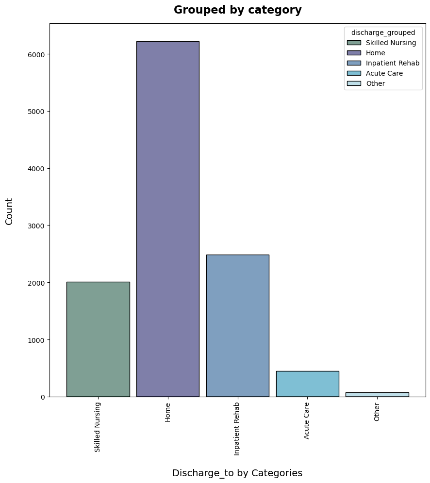

# Identification of Patterns in Stroke Care Transitions, using [OHDSI](https://ohdsi.northeastern.edu/) Pharmetrics+ data

Below are our results from working with the OHDSI database to determine care pathways for patients after their initial stroke. DS5110 Fall 2024

## Major Findings - Delivering an Intermim Step

- Stroke patients with aphasia can be identified.
- Different locations post-acute care, with dates attached, can be tracked for individual patients.
- Speech therapy procedure occurrences, with dates, can be appended to patient records.

### 1. Establish Cohort

 

### 2. Append Aphasia Diagnosis

 

### 3.1 First Discharge Path for All Cohort Patients

### 3.2 Categories for Discharge Facilities - All

 

### 3.3 Categories for Discharge Facilities - No Aphasia vs Aphasia

### No Aphasia

 

### Has Aphasia

 

### 4. Discharge from Locations (2, 3, 4, 5)

 

### 5. Speech Therapy

## Challenges

**Reproducibility**

- The reproducibility for this repo is possible if the user first has access to the AWS Workspace and OHDSI database.

- There may be a time in the future when Northeastern OHDSI offers a public version of their database and then any user would be able to reproduce our results.

 

**Database Complexity**

- OHDSI is an observational health database based on real-world data, therefore missing data is not uncommon and can hinder establishing table relationships that will provide enough data for analysis.

- Even though OHDSI is based on OMOP's Common Data Model, health codes in claims can be entered subjectively based on the hospital or doctor. Therefore, it is challenging to determine the most effective codes for cohort creation, therapy codes to track the correct care pathways, etc.

 

**Amazon Workspace**

- The data had to be accessed through Amazon Workspaces because of sensitive personal data. In the beginning of the semester, OHDSI's Workspacee tier was tested by the number of students working with OHDSI this semester in the 5110 and Capstone classes. Access to the workspaces and speed within the system was inconsistent for some students.

- The OHDSI virtual desktop comes installed with a Windows operating system. In the beginning of the semester we tried to configure a way to install Windows Subsystem for Linux; however, it was not a straighforward path and presented time-consuming challenges. For instance, WSL 2 is not compatible with Amazon Workspaces. WSL 1 is said to work, but it needs to be installed on Windows Server 2019, and we still ran into compatibility issues.
